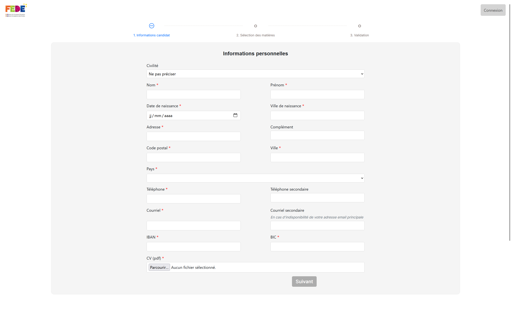

<?php
use PHPMailer\PHPMailer\PHPMailer;
use PHPMailer\PHPMailer\Exception;

require __DIR__ . '/vendor/autoload.php';

$success = null;
$error = null;

if ($_SERVER['REQUEST_METHOD'] === 'POST') {

    // Sécurisation des données
    $name    = htmlspecialchars(trim($_POST['name']));
    $email   = filter_var($_POST['email'], FILTER_VALIDATE_EMAIL);
    $message = htmlspecialchars(trim($_POST['message']));

    if (!$email) {
        $error = "Adresse email invalide.";
    } else {
        $mail = new PHPMailer(true);
        try {
            $mail->isSMTP();
            $mail->Host = 'smtp.hostinger.com';
            $mail->SMTPAuth = true;
            $mail->Username = 'portfolio@geoffreyfranz.fr';
            $mail->Password = 'Tchouni.0102';
            $mail->SMTPSecure = 'ssl'; // ou 'ssl'
            $mail->Port = 465;
            $mail->CharSet = 'UTF-8';
            $mail->isHTML(true);

            // EXPÉDITEUR
            $mail->setFrom('portfolio@geoffreyfranz.fr', 'Portfolio'); // identique aussi
            $mail->addReplyTo('portfolio@geoffreyfranz.fr', 'Portfolio'); // optionnel
            $mail->addAddress('franz.geoffrey@hotmail.fr'); //
            // CONTENU
            $mail->isHTML(true);
            $mail->Subject = "Nouveau message depuis le portfolio";
            $mail->Body    = "
                <h2>Nouveau message reçu</h2>
                
<strong>Nom :</strong> {$name}

                
<strong>Email :</strong> {$email}

                
<strong>Message :</strong> {$message}

            ";
            $mail->send();
            $success = "Votre message a bien été envoyé.";
        } catch (Exception $e) {
            $error = "Erreur lors de l'envoi : " . $mail->ErrorInfo;
        }
    }
}
?>
<!DOCTYPE html>
<html lang="fr">
<head>
    <meta charset="utf-8">
    <meta name="viewport" content="width=device-width, initial-scale=1">
    <title>Geoffrey Franz</title>
    <link rel="stylesheet" href="newstyle.css">
</head>

<body>

    <aside class="sidebar">
        <nav>
            <a href="#" data-target="header">Introduction</a>
            <a href="#" data-target="skills">Compétences</a>
            <a href="#" data-target="projects">Projets</a>
            <a href="CV.pdf" target="_blank">CV</a>
            <a href="#" data-target="contact">Contact</a>
        </nav>
    </aside>
    <section id="header" class="header-section section active">
        

            <h1 class="header-title">Geoffrey FRANZ</h1>
            

            <h2 class="header-name">Développeur Web – en recherche d'alternance IA (EPITECH)</h2>
        

        

            <!-- Colonne gauche -->
            

                

                    
                

            

            <!-- Colonne droite -->
            

                <h2>À propos</h2>

                
Je m’appelle Geoffrey Franz, développeur web avec une solide expérience sur des projets front et back. J’aime construire des applications claires, fiables et bien structurées, avec une attention particulière portée à l’expérience utilisateur et à la qualité du code.

                
Aujourd’hui, je fais évoluer mon parcours vers l’intelligence artificielle. Je me forme activement aux concepts et aux outils modernes de l’IA afin d’enrichir mon profil de développeur et d’apporter une dimension plus intelligente et automatisée aux projets que je construis.

                
Mon objectif est simple : combiner mes compétences web avec l’IA pour créer des solutions plus efficaces, plus utiles et plus ambitieuses.

            

        

        

            <h2>Alternance IA – EPITECH</h2>

            
Actuellement étudiant à EPITECH, je suis en recherche d’une alternance orientée <strong>IA</strong>, afin de me spécialiser et d’apprendre au contact de projets concrets. Je souhaite rejoindre une équipe où je peux progresser, contribuer, et monter en compétence sur les technologies d’intelligence artificielle.

            
Je suis motivé par les environnements où l’on peut expérimenter, comprendre les enjeux métier, et transformer des idées en outils réels. Je suis autonome, rigoureux, et à l’aise pour documenter, communiquer et travailler en équipe.

            
Si vous recherchez un profil sérieux, capable d’apprendre vite et de s’investir pleinement dans une alternance IA, je serais ravi d’échanger avec vous.

        

    </section>

    <section id="projects" class="section">

        

            <h2 class="project-title">Plateforme de gestion des intervenants – FEDE</h2>

            <a class="project-link" href="https://intervenants.fede.education" target="_blank">
                https://intervenants.fede.education
            </a>
            

                Symfony
                JavaScript
                MySQL
                Microsoft Entra
                SharePoint
                Docker
                OVH
            

            

        

        

            

                
            

            

                <h3>Présentation du projet</h3>

                

                    J’ai développé une plateforme complète permettant de gérer les candidatures des intervenants
                    de la Fédération Européenne des Écoles. Ce projet s’inscrit au cœur du système d’information
                    de la FEDE : il centralise les demandes, automatise les validations et crée les comptes
                    intervenants directement dans Microsoft Entra (Azure AD), afin de permettre l’accès aux
                    différentes applications internes.
                

                

                    Le système repose sur un formulaire multi‑étapes avancé, un workflow métier structuré,
                    un audit log détaillé, une gestion fine des rôles et des permissions, ainsi qu’une intégration
                    profonde avec les services Microsoft (Entra, SharePoint) et les services AWS déjà en place.
                    Les documents (CV, pièces justificatives) sont automatiquement envoyés dans SharePoint,
                    tandis que les comptes intervenants sont créés et configurés via l’API Entra.
                

                

                    Ce projet a été réalisé en autonomie quasi totale, en collaboration directe avec les équipes
                    pédagogiques et administratives. J’ai conçu l’architecture, développé le front et le back,
                    mis en place les intégrations cloud, sécurisé les endpoints, et déployé l’ensemble sur le VPS OVH
                    via un environnement Docker. Le résultat est une application robuste, maintenable et utilisée
                    quotidiennement pour gérer les intervenants du réseau FEDE.
                

            

            

                

                    

                        <h3>Frontend</h3>
                        <ul>
                            <li>Twig + JavaScript pur</li>
                            <li>Formulaire multi‑étapes dynamique (validation progressive)</li>
                            <li>Affichage intelligent des catégories de matières</li>
                            <li>Gestion des rôles intervenants (UI dédiée)</li>
                            <li>Récapitulatif complet avant validation</li>
                            <li>UX claire, structurée et pensée pour les équipes pédagogiques</li>
                        </ul>
                    

                    

                        <h3>Infra & Cloud</h3>
                        <ul>
                            <li>Déploiement sur VPS OVH</li>
                            <li>Environnement Docker (multi‑services)</li>
                            <li>Microsoft Entra (authentification + provisioning utilisateurs)</li>
                            <li>SharePoint (stockage documentaire)</li>
                            <li>Intégration AWS Lambda / SQS pour les tâches asynchrones</li>
                            <li>Gestion des permissions et sécurité des endpoints</li>
                        </ul>
                    

                    

                        <h3>Backend</h3>
                        <ul>
                            <li>Workflow multi‑étapes (soumission → validation → création compte)</li>
                            <li>SQL : candidatures + pièces jointes</li>
                            <li>Provisioning automatique via Microsoft Entra (Azure AD)</li>
                            <li>Rôles & permissions dynamiques</li>
                            <li>Endpoints sécurisés (intégrations internes)</li>
                            <li>Statuts : à traiter / accepté / refusé / modifié</li>
                            <li>Audit log complet (actions & transitions)</li>
                            <li>SharePoint : stockage CV & documents</li>
                            <li>AWS : Lambda / SQS (automatisations)</li>

                        </ul>
                    

                

            

        

        

            <h2 class="project-title">Générations de PDF  – FEDE</h2>

            

                Python
                AWS
                Lambda
            

            

        

        

            

                <h3>Présentation du projet</h3>

                

                    J’ai développé un service complet de génération de documents PDF automatisés pour la Fédération
                    Européenne des Écoles. L’objectif était de produire des documents complexes à partir de données
                    métier, avec une mise en page dynamique, des sections conditionnelles, des tableaux, des fusions
                    de pages et une pagination intelligente.
                

                

                    Le cœur du système repose sur une Lambda AWS écrite en Python, utilisant ReportLab pour la
                    génération programmatique et PyPDF2 pour la fusion et la manipulation des pages. Le service
                    récupère les données, construit le document, applique les règles métier, puis stocke le PDF
                    final dans un bucket S3 via des URLs pré‑signées.
                

                

                    Ce projet m’a demandé d’apprendre rapidement un nouvel environnement technique, de comprendre
                    un workflow métier complet et de livrer un outil fiable utilisé quotidiennement par les équipes
                    internes. J’ai travaillé en autonomie guidée : accompagné lorsque nécessaire, mais responsable
                    de l’analyse et de l’implémentation du service, ainsi que de son intégration avec l’intranet
                    existant.
                

                

                    Le résultat est un service robuste, maintenable et automatisé, qui a permis de réduire
                    significativement le temps de production documentaire tout en améliorant la qualité et la
                    cohérence des documents générés.
                

            

            

                

                    

                        <h3>Frontend</h3>
                        <ul>
                            <li>Interface interne pour déclencher la génération</li>
                            <li>Formulaire de sélection des données à intégrer</li>
                            <li>Affichage des documents générés</li>
                            <li>Gestion des erreurs et retours utilisateur</li>
                            <li>Intégration dans l’écosystème FEDE existant</li>
                        </ul>
                    

                    

                        <h3>Infra & Cloud</h3>
                        <ul>
                            <li>AWS Lambda (serverless)</li>
                            <li>AWS S3 (stockage des PDF)</li>
                            <li>IAM (permissions minimales)</li>
                            <li>CloudWatch (logs & monitoring)</li>
                            <li>Intégration avec les API internes FEDE</li>
                            <li>Déploiement automatisé via pipeline interne</li>
                        </ul>
                    

                    

                        <h3>Backend</h3>
                        <ul>
                            <li>Lambda AWS en Python</li>
                            <li>Génération PDF avancée (ReportLab)</li>
                            <li>Fusion et manipulation de pages (PyPDF2)</li>
                            <li>Règles métier complexes (sections conditionnelles)</li>
                            <li>Pagination dynamique</li>
                            <li>Stockage S3 via presigned URLs</li>
                            <li>Gestion des erreurs et logs structurés</li>
                            <li>Documentation technique complète</li>
                        </ul>
                    

                

            

        

        

            <h2 class="project-title">Equivalences – FEDE</h2>
            <a class="project-link" href="https://equivalences.fede.education" target="_blank">
                https://intervenants.fede.education
            </a>
            

                React
                JavaScript
                Node.js
                AWS S3
                Api
                Stripe
            

            

        

        

            

                
            

            

                <h3>Présentation du projet</h3>
                

                    Ce projet permet aux écoles partenaires de soumettre des demandes d’équivalences
                    afin d’inscrire un étudiant directement à un certain niveau, à condition qu’il
                    fournisse les justificatifs nécessaires (diplôme équivalent, expérience
                    professionnelle, certifications, etc.). Le système applique un ensemble de règles
                    métier structurées pour garantir une décision cohérente, fiable et standardisée.
                

                

                    L’interface est développée en <strong>React</strong> avec une logique orientée
                    composant : formulaires dynamiques, validation en temps réel, gestion des états,
                    upload des fichiers, messages d’erreur contextualisés et sélection de la langue.
                    L’ensemble du parcours est entièrement multilingue grâce à une couche
                    <strong>i18n</strong> (FR/EN) qui gère la traduction des labels, des messages
                    métier et des retours d’erreur.
                

                

                    Le frontend communique avec une API interne en <strong>Node.js</strong> qui
                    contient le moteur d’équivalences, la gestion des règles métier, les contrôles
                    d’intégrité, la création des sessions Stripe, le traitement du webhook et
                    l’envoi automatique des emails. Les pièces justificatives sont stockées dans
                    <strong>AWS S3</strong> et toutes les opérations critiques sont monitorées via
                    <strong>CloudWatch</strong>.
                

                

                    Le workflow complet : sélection du pays et du niveau → remplissage du formulaire
                    → upload des pièces justificatives → validation → création de la session Stripe
                    → paiement → webhook Stripe → génération du résultat → envoi automatique des
                    emails (école + FEDE) avec les pièces jointes stockées dans S3.
                

            

            

                

                    

                        <h3>Frontend</h3>
                        <ul>
                            <li>React</li>
                            <li>React Hooks & State Management</li>
                            <li>Formulaires dynamiques</li>
                            <li>Validation en temps réel</li>
                            <li>Upload de fichiers</li>
                            <li>i18n (FR/EN) – JSON versionnés</li>
                            <li>Gestion des erreurs contextualisées</li>
                            <li>Appels API sécurisés</li>
                        </ul>
                    

                    

                        <h3>Infra & Cloud</h3>
                        <ul>
                            <li>AWS Lambda (serverless)</li>
                            <li>AWS S3 (stockage des pièces + règles + i18n)</li>
                            <li>AWS CloudWatch (logs & monitoring)</li>
                            <li>CI/CD léger</li>
                            <li>Gestion des environnements</li>
                            <li>Sécurisation des accès</li>
                        </ul>
                    

                    

                        <h3>Backend</h3>
                        <ul>
                            <li>Node.js</li>
                            <li>API interne custom</li>
                            <li>Moteur d’équivalences (règles métier)</li>
                            <li>Gestion des exceptions</li>
                            <li>Stripe (session + webhook)</li>
                            <li>Envoi automatique d’emails</li>
                            <li>Validation des données</li>
                            <li>i18n backend (messages métier traduits)</li>
                        </ul>
                    

                

            

        

    </section>
    <section id="skills" class="section">
        

            <h1 class="header-title">Compétences</h1>
            

        

        

            <article class="concept-card">
                <h4>Back-end</h4>
                <ul>
                    <li>PHP</li>
                    <li>Symfony</li>
                    <li>Node.js</li>
                    <li>SQL</li>
                    <li>API</li>
                    <li>Sécurité & authentification (JWT, rôles)</li>
                    <li>Tests & qualité (PHPUnit, clean code)</li>
                </ul>
            </article>
            <article class="concept-card">
                <h4>Front-end</h4>
                <ul>
                    <li>Html</li>
                    <li>Css</li>
                    <li>Bootstrap</li>
                    <li>React</li>
                    <li>Javascript</li>
                    <li>Intégration</li>
                </ul>
            </article>
            <article class="concept-card">
                <h4>Cloud/Devops</h4>
                <ul>
                    <li>AWS (Lambda, S3, CloudFront, IAM)</li>
                    <li>Microsoft Entra</li>
                    <li>Docker</li>
                    <li>Postman</li>
                    <li>CI/CD (GitHub Actions)</li>
                    <li>Monitoring & logs</li>
                    <li>Déploiements automatisés</li>
                </ul>
            </article>
            <article class="concept-card">
                <h4>Soft Skill</h4>
                <ul>
                    <li>Autonomie</li>
                    <li>Organisation rigoureuse</li>
                    <li>Communication claire</li>
                    <li>Résolution de problèmes complexes</li>
                    <li>Pensée critique & logique</li>
                </ul>
            </article>
        

        

            <h1 class="header-title">Montée en compétences IA</h1>
            

        

        <!-- Bloc 1 : Concepts actuels -->
        

            <h3 class="learning-block-title">Concepts de mon réseau neuronal</h3>
            

                <article class="concept-card">
                    <h4>Neurone artificiel</h4>
                    
Entrées → poids → somme → activation. C’est l’unité de base du réseau.

                </article>
                <article class="concept-card">
                    <h4>Poids & biais</h4>
                    
Paramètres appris par le modèle. Les poids contrôlent l’influence,
                        le biais décale la sortie.
                    

                </article>
                <article class="concept-card">
                    <h4>Fonction d’activation</h4>
                    
ReLU utilisée pour introduire de la non-linéarité et stabiliser l’apprentissage.

                </article>
                <article class="concept-card">
                    <h4>Forward pass</h4>
                    
Calcul de la prédiction du réseau avant comparaison à la vérité terrain.

                </article>
                <article class="concept-card">
                    <h4>Backpropagation</h4>
                    
Mécanisme d’ajustement des poids basé sur le gradient de la fonction de perte.

                </article>
                <article class="concept-card">
                    <h4>Fonction de perte</h4>
                    
Mesure de l’erreur du modèle (MSE, Cross-Entropy selon la tâche).

                </article>
                <article class="concept-card">
                    <h4>Optimiseur</h4>
                    
Algorithmes comme SGD ou Adam pour mettre à jour les poids efficacement.

                </article> <article class="concept-card">
                    <h4>Architecture dense</h4>
                    
Réseau composé de couches fully connected (Dense), nombre de couches et de neurones
                        par couche.

                </article>
            

            * Le réseau neuronal est dispo dans la section compétences et sur mon Github
        

        <!-- Bloc 2 : Étape suivante -->
        

            <h3 class="learning-block-title">Étape suivante de mon apprentissage</h3>
            

                

                    Étape 1
                    <h4>Premier MLP complet</h4>
                    
Construire un réseau fully connected avec plusieurs couches denses et
                        ReLU entre chaque couche.
 

                

                    Étape 2
                    <h4>Pipeline d’entraînement</h4>
                    
Mettre en place une boucle d’entraînement complète : forward, perte, backpropagation, optimisation.

                

                

                    Étape 3
                    <h4>Projet concret</h4>
                    
Entraîner ce MLP sur un dataset simple (ex : classification MNIST ou binaire) et analyser les résultats.

                

            

        

    </section>
    <section id="contact" class="section">
        <?php if ($success): ?>
            
<?= $success ?>

        <?php endif; ?>

        <?php if ($error): ?>
            
<?= $error ?>

        <?php endif; ?>

        <form action="" method="POST" class="contact-form">
            

                <label for="name">Nom</label>
                <input type="text" id="name" name="name" required />
            

            

                <label for="email">Email</label>
                <input type="email" id="email" name="email" required />
            

            

                <label for="message">Message</label>
                <textarea id="message" name="message" rows="5" required></textarea>
            

            <button type="submit" class="btn">Envoyer</button>
        </form>
    </section>

</body>

</html>
* {
    box-sizing: border-box;
    margin: 0;
    padding: 0;
    overflow-x: hidden;
    background: #020314;
}
#container {

}

/* --------- ASIDE COSMIC --------- */

.sidebar {
position: fixed;
left: 0;
top: 0;
bottom: 0;
width: 10%;
padding: 2rem 2rem;
z-index: 2;
display: flex;
flex-direction: column;
gap: 2rem;
pointer-events: auto;
backdrop-filter: blur(6px);

    /* --- HOLO BORDER RIGHT --- */
    border-right: none;
    background-image: linear-gradient(
            to bottom,
            rgba(0,150,255,0) 0%,
            rgba(0,150,255,0.7) 50%,
            rgba(0,150,255,0) 100%
    );
    background-repeat: no-repeat;
    background-size: 2px 100%;
    background-position: right center;
    filter: drop-shadow(0 0 8px rgba(0,150,255,0.6));
}

.sidebar h2 {
margin: 0;
font-size: 1.6rem;
font-weight: 600;
color: #eaf6ff;
}

.sidebar nav {
display: flex;
flex-direction: column;
gap: 2rem;
justify-content: end;

}

.sidebar nav a {
color: #d8eaff;
text-decoration: none;
font-size: 1rem;
font-weight: 500;
transition: color 0.25s ease;
}

.sidebar nav a:hover {
color: #9cd8ff;
}
/* Toutes les sections (header, skills, etc.) */
.section {
position: absolute;
top: 0;
left: 180PX;
width: calc(100% - 260px);
height: 100vh;
padding: 0 3rem;
opacity: 0;
filter: blur(12px);
pointer-events: none;
transition: opacity 0.45s ease, filter 0.45s ease;
scrollbar-width: thin;
scrollbar-color: rgba(0, 150, 255, 0.3) transparent;
}

.section::-webkit-scrollbar {
width: 6px;
}

.section::-webkit-scrollbar-track {
background: transparent;
}

.section::-webkit-scrollbar-thumb {
background: rgba(0, 150, 255, 0.2);
border-radius: 10px;
}

.section::-webkit-scrollbar-thumb:hover {
background: rgba(0, 150, 255, 0.5);
}
.section.active {
opacity: 1;
filter: blur(0px);
pointer-events: auto;
backdrop-filter: blur(2px);
}

/* --- Réorganisation du header --- */

.header-content {
width: 100%;
margin-bottom: 2rem;
padding-top: 1rem;
display: flex;
flex-direction: column;
justify-content: flex-start;
}

/* Accroche */
.header-tagline {
margin: 0.8rem 0 1.8rem;
font-size: 1.2rem;
font-weight: 300;
color: #dceaff;
opacity: 0.85;
}

/* A propos dans le header */
.header-about p {
margin: 0;
margin-top: 1rem;
font-size: 1rem;
line-height: 1.6;
color: #e8f6ff;
opacity: 0.85;
}

/* Titre en une seule ligne */
.header-title {
font-size: 3rem;
font-weight: 300;
margin: 0;
white-space: nowrap;
color: #ffffff;
}

    .holo-divider.big {
        height: 1px; /* fine, élégante */
        width: 110%; /* plus longue */
        margin: 0;
        /*transform: translateX(-30%); !* centrage visuel *!*/
        background: linear-gradient(90deg,
        rgba(0,150,255,0) 0%,
        rgba(0,150,255,0.8) 25%,
        rgba(0,150,255,0) 80%
        );
        filter: drop-shadow(0 0 10px rgba(0,150,255,0.7));
    }
.holo-divider.small {
height: 1px; /* fine, élégante */
width: 110%; /* plus longue */
margin: 0.15rem 0;
/*transform: translateX(-30%); !* centrage visuel *!*/
background: linear-gradient(90deg,
rgba(0,150,255,0) 0%,
rgba(0,150,255,0.8) 10%,
rgba(0,150,255,0) 40%
);
filter: drop-shadow(0 0 10px rgba(0,150,255,0.7));
}

/* --------- HEADER FULLSCREEN TRANSPARENT --------- */

/* Badges */
.header-badges {
display: flex;
flex-wrap: wrap;
gap: 0.6rem;
margin-bottom: 2rem;
}
.header-name {
font-size: 2.2rem;
font-weight: 500;
color: #e8f6ff;
margin: 0 0 0.4rem;
opacity: 0.9;
}

.header-badges .badge {
padding: 0.4rem 0.8rem;
background: rgba(6, 12, 32, 0.85);
border: 1px solid rgba(148, 221, 255, 0.25);
border-radius: 6px;
color: #e8f6ff;
font-size: 0.9rem;
opacity: 0.5;
box-shadow:
0 0 12px rgba(0,150,255,0.35),
0 0 22px rgba(0,80,170,0.25);
}
.header-badges.tight {
gap: 1rem;
margin-bottom: 1.2rem;
}
.header-tagline {
margin: 0 0 1.6rem;
font-size: 1.1rem;
font-weight: 200;      /* plus léger que lighter */
font-style: italic;    /* ce que tu veux */
color: #dceaff;
opacity: 0.75;         /* plus aérien */
letter-spacing: 0.3px; /* optionnel mais premium */
}

/* SECTION INTRO */
#intro {
max-width: 1100px;
margin-top: 6em;
padding: 4rem 0;
color: #e8f6ff;
}

/* Header intro */
.intro-header {
margin-bottom: 2.5rem;
text-align: left;
}

.intro-name {
font-size: 2.4rem;
font-weight: 700;
margin: 0;
}

.intro-role {
margin-top: 0.4rem;
font-size: 1.05rem;
color: #8fbce8;
opacity: 0.9;
}

/* Layout 2 colonnes */
.intro-layout {
display: flex;
gap: 3rem;
align-items: flex-start;
}

.intro-col {
width: 30%;
}

/* Photo */
.intro-photo-wrapper {
width: 100%;
margin-bottom: 1.8rem;
}

.intro-photo {
width: 100%;
max-width: 260px;
border-radius: 1rem;
display: block;
box-shadow: 0 0 20px rgba(0, 140, 255, 0.25);
}

/* Titres */
.intro-text-block h2 {
font-size: 1.3rem;
margin-bottom: 1rem;
color: #b9dfff;
}

/* Paragraphes */
.intro-text-block p {
margin-bottom: 1rem;
line-height: 1.65;
opacity: 0.9;
color: #b9dfff;
}
/* ===== SECTION PROJECTS ===== */

#projects {
padding: 1rem 3rem;
color: #e8f6ff;

}

.project-header {

}

/* Titre principal */
.project-title {
font-size: 2.2rem;
font-weight: 300;
margin: 0 0 0.5rem;
color: #ffffff;
letter-spacing: 0.5px;
}

/* Lien */
.project-link {
color: #7acbff;
font-size: 1rem;
text-decoration: none;
opacity: 0.9;
}
.project-link:hover {
opacity: 1;
}

/* Tags */
.project-tags {
display: flex;
flex-wrap: wrap;
gap: 0.6rem;
margin: 1rem 0 2rem;
}

.project-tags .tag {
padding: 0.35rem 0.75rem;
background: rgba(6, 12, 32, 0.85);
border: 1px solid rgba(148, 221, 255, 0.25);
border-radius: 6px;
font-size: 0.85rem;
opacity: 0.85;
}

/* HOLOGRAPHIC DIVIDER */
.holo-divider {
width: 100%;
height: 2px;
margin: 1.5rem 0 2.5rem;
background: linear-gradient(90deg,
rgba(0,150,255,0) 0%,
rgba(0,150,255,0.6) 50%,
rgba(0,150,255,0) 100%
);
filter: drop-shadow(0 0 6px rgba(0,150,255,0.6));
}
.project-content {
display: flex;
flex-wrap: wrap;
justify-content: space-between;
}

.project-image {
width: 85%;
}
.project-image img {
width: 100%;
}
.d-column {
display: flex;
/*flex-direction: row;*/
flex-wrap: wrap;
width: 100%;
}
/* Colonnes */
.project-columns {
display: flex;
flex-wrap: wrap;
width: 100%;
justify-content: end;
}

.project-col {
width: 100%;
}

.project-col h3 {
font-size: 1.3rem;
font-weight: 400;
margin-bottom: 0.8rem;
color: #bfe8ff;
}

.project-col ul {
margin: 0;
padding-left: 1.2rem;
line-height: 1.6;
opacity: 0.9;
}

/* Story */
.project-story {
margin-top: 0;
max-width: 900px;
}

.project-story h3 {
font-size: 1.4rem;
font-weight: 400;
margin-bottom: 1rem;
color: #bfe8ff;
}

.project-story p {
line-height: 1.7;
opacity: 0.9;
margin-bottom: 1rem;
}
.skills-section {
width: 100%;
padding: 40px 0;
}

.skills-title {
font-size: 2.2rem;
margin-bottom: 30px;
text-align: center;
}

.skills-grid {
display: grid;
grid-template-columns: repeat(4, 1fr);
gap: 40px;
width: 100%;
}

.skill-col h3 {
font-size: 1.6rem;
font-weight: 600;
color: #ffffff;
margin-bottom: 1.5rem;
padding-bottom: 0.5rem;
position: relative;
text-transform: uppercase;
letter-spacing: 0.5px;
text-align: left;
filter: drop-shadow(0 0 8px rgba(0,150,255,0.6));
}

/* Ligne cosmique horizontale */
.skill-col h3::after {
content: '';
position: absolute;
bottom: -7px;
left: -25px;
width: 100%;
height: 1.5px;
background: linear-gradient(
to right,
rgba(0,150,255,0) 0%,
rgba(0,150,255, 1) 50%,
rgba(0,150,255,0) 100%
);
box-shadow: 0 0 100px rgba(0, 150, 255, 1);
border-radius: 2px;
}

.skill-col ul {
list-style: none;
padding: 0;
margin: 0;
}

.skill-col li {
margin-bottom: 10px;
line-height: 1.4;
color: #e8f6ff;
}

/* Responsive */
@media (max-width: 1100px) {
.skills-grid {
grid-template-columns: repeat(2, 1fr);
}
}

@media (max-width: 600px) {
.skills-grid {
grid-template-columns: 1fr;
}
}

/* ===== SECTION APPRENTISSAGE IA ===== */

.learning-section {
width: 100%;
padding: 4rem 0;
color: #e8f6ff;
}

.learning-title {
font-size: 2.2rem;
font-weight: 300;
text-align: center;
margin-bottom: 0.5rem;
color: #ffffff;
}

.learning-subtitle {
text-align: center;
font-size: 1rem;
opacity: 0.75;
margin-bottom: 3rem;
}

/* Bloc général */
.learning-block {
margin-bottom: 4rem;
}

.learning-block-title {
font-size: 1.6rem;
font-weight: 500;
margin-bottom: 1.5rem;
color: #bfe8ff;
position: relative;
}

/* Ligne holo sous le titre */
.learning-block-title::after {
content: '';
position: absolute;
bottom: -6px;
left: 0;
width: 120px;
height: 2px;
background: linear-gradient(
90deg,
rgba(0,150,255,0) 0%,
rgba(0,150,255,0.8) 50%,
rgba(0,150,255,0) 100%
);
filter: drop-shadow(0 0 8px rgba(0,150,255,0.7));
}

/* Cartes des concepts */
.concepts-grid {
display: grid;
grid-template-columns: repeat(auto-fill, minmax(260px, 1fr));
gap: 1.8rem;
}

.concept-card {
color: white;
background: rgba(6, 12, 32, 0.55);
border: 1px solid rgba(148, 221, 255, 0.15);
border-radius: 10px;
padding: 1.2rem 1.4rem;
box-shadow: 0 0 12px rgba(0,150,255,0.15);
backdrop-filter: blur(4px);
transition: transform 0.25s ease, box-shadow 0.25s ease;
}
.concept-card *, .concept-card {
background: rgba(6, 12, 32, 0.55);
}

.concept-card:hover {
transform: translateY(-4px);
box-shadow: 0 0 18px rgba(0,150,255,0.35);
}

.concept-card h4 {
margin: 0 0 0.6rem;
font-size: 1.2rem;
color: #bfe8ff;
}

.concept-card p {
margin: 0;
font-size: 0.95rem;
opacity: 0.85;
line-height: 1.5;
}

/* Roadmap */
.roadmap-steps {
display: flex;
flex-direction: column;
gap: 1.8rem;
margin-top: 2rem;
}

.roadmap-step {
padding: 1.4rem 1.6rem;
background: rgba(6, 12, 32, 0.55);
border: 1px solid rgba(148, 221, 255, 0.15);
border-radius: 10px;
box-shadow: 0 0 12px rgba(0,150,255,0.15);
backdrop-filter: blur(4px);
}

.step-tag {
display: inline-block;
padding: 0.25rem 0.6rem;
font-size: 0.75rem;
background: rgba(0,150,255,0.25);
border: 1px solid rgba(0,150,255,0.4);
border-radius: 4px;
margin-bottom: 0.6rem;
color: #bfe8ff;
}

.roadmap-step h4 {
margin: 0 0 0.4rem;
font-size: 1.2rem;
color: #e8f6ff;
}

.roadmap-step p {
color: white;
margin: 0;
opacity: 0.85;
line-height: 1.5;
}

.contact-form {
max-width: 520px;
margin: 80px auto;
padding: 40px;
background: rgba(6, 12, 32, 0.55);
border: 1px solid rgba(148, 221, 255, 0.25);
border-radius: 12px;
backdrop-filter: blur(6px);
box-shadow: 0 0 18px rgba(0,150,255,0.15);
}

/* Groupes */
.form-group {
display: flex;
flex-direction: column;
gap: 6px;
margin-bottom: 24px;
width: 100%;
}

/* Labels */
.form-group label {
font-size: 0.9rem;
font-weight: 500;
color: #bfe8ff;
letter-spacing: 0.4px;
}

/* Inputs */
.form-group input,
.form-group textarea {
padding: 14px 16px;
font-size: 0.95rem;
color: #e8f6ff;
background: rgba(6, 12, 32, 0.85);
border: 1px solid rgba(148, 221, 255, 0.15);
border-radius: 10px;
backdrop-filter: blur(2px);
transition: border-color 0.25s ease, box-shadow 0.25s ease;
}

/* Focus */
.form-group input:focus,
.form-group textarea:focus {
border-color: #4da3ff;
box-shadow: 0 0 8px rgba(0,150,255,0.3);
outline: none;
}

/* Bouton premium */
.btn {
width: 100%;
padding: 14px 20px;
background: linear-gradient(135deg, #2563ff, #1d4ed8);
border: none;
border-radius: 9999px;
color: #f9fbff;
font-size: 1rem;
font-weight: 600;
letter-spacing: 0.4px;
cursor: pointer;
transition: background 0.25s ease, transform 0.2s ease;
box-shadow: 0 0 6px rgba(0,150,255,0.25);
}

.btn:hover {
background: linear-gradient(135deg, #3b82f6, #2563eb);
transform: translateY(-2px);
}

.btn:active {
transform: translateY(0);
}

/* Messages */
.alert {
max-width: 520px;
margin: 24px auto;
padding: 16px 20px;
border-radius: 10px;
font-size: 0.95rem;
font-weight: 500;
backdrop-filter: blur(4px);
text-align: center;
}

.alert.success {
background: rgba(0, 255, 150, 0.12);
border: 1px solid rgba(0, 255, 150, 0.3);
color: #b2f5dc;
}

.alert.error {
background: rgba(255, 80, 80, 0.12);
border: 1px solid rgba(255, 80, 80, 0.3);
color: #f5b2b2;
}
#projects {
height: 100vh;
overflow-y: auto;
scroll-behavior: smooth;
scroll-snap-type: y mandatory;
}

.project-block {
min-height: 100vh;
padding:  1rem 0;
border-bottom: 1px solid rgba(0, 150, 255, 0.1);
scroll-snap-align: start;
overflow-y: auto;
margin-bottom: 11rem;
}

.project-content {
display: grid;
grid-template-columns: 1fr 1fr;
gap: 1.5rem;
align-items: flex-start;
}
.project-image {
width: 85%;
}
.project-image img {
width: 100%;
border-radius: 8px;
box-shadow: 0 4px 12px rgba(0,0,0,0.3);
}

.project-story p {
margin-bottom: 0.6rem;
line-height: 1.4;
}

.d-column {
grid-column: span 2;
}

.project-columns {
display: grid;
grid-template-columns: repeat(auto-fit, minmax(180px, 1fr));
gap: 1rem;
}

.project-col h3 {
font-size: 1rem;
margin-top: 0.5rem;
margin-bottom: 0.4rem;
color: #bfe8ff;
border-bottom: 1px solid rgba(0, 150, 255, 0.2);
display: inline-block;
}

.project-col ul {
margin: 0;
padding-left: 1.1rem;
column-gap: 1rem;
}

@media (max-width: 992px) {
.sidebar {
width: 100%;
height: auto;
bottom: auto;
flex-direction: row;
padding: 1rem;
justify-content: center;
border-right: none;
border-bottom: 1px solid rgba(0,150,255,0.3);
background-size: 100% 2px;
background-position: bottom center;
}
.sidebar nav {
flex-direction: row;
gap: 1.5rem;
}
.section {
left: 0;
width: 100%;
padding: 80px 1.5rem 2rem;
}
.project-content {
display: flex;
flex-direction: column;
}
.project-columns {
display: flex;
flex-direction: column;
}
.project-story {
flex: 1 1 auto;
}
}

